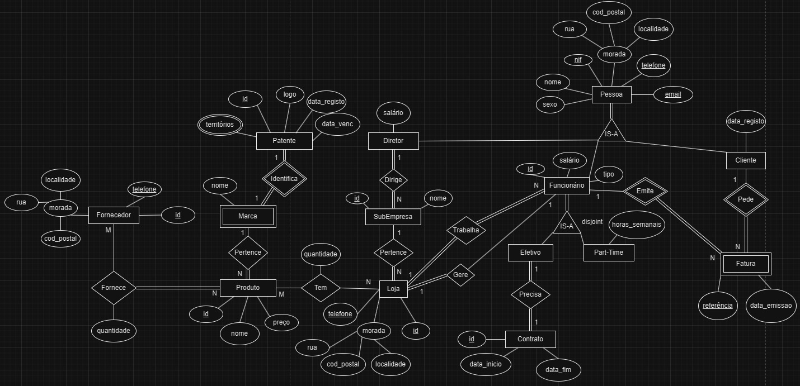
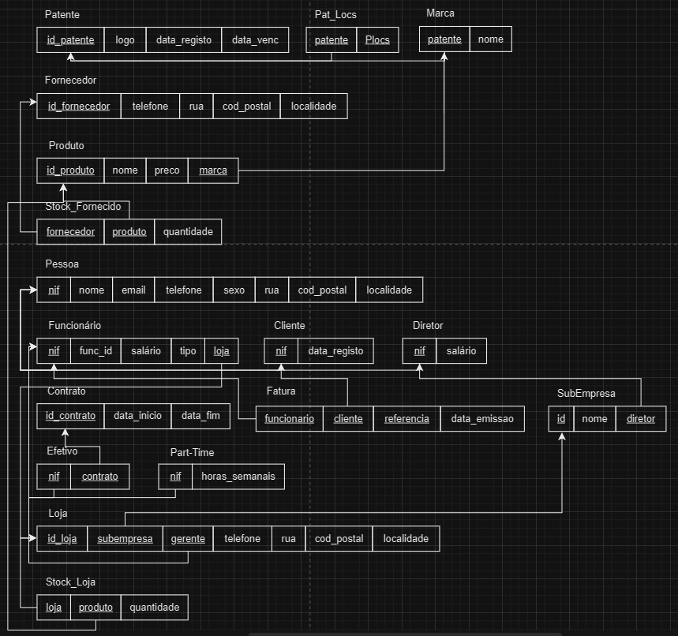

# BD: Trabalho Prático APFE

**Grupo**: P5G10
- Guilherme Santos, MEC: 113893
- Diogo Guedes, MEC: 114256

## Introdução / Introduction
 
O nosso trabalho consiste numa base de dados que permita a uma empresa, que tem uma grande dimensão e que é dona de várias marcas e várias subempresas, conseguir gerir quem trabalha nela, quem gere o quê, que marcas de que é dona, quantos produtos de que marca tem em que loja, etc.
Resumindo, é uma base de dados para facilitar a gerência de uma empresa grande, dona de várias marcas.

## ​Análise de Requisitos / Requirements

### Entidades:

#### Pessoa
Pessoa, que pode ser Funcionário ou Diretor ou Gerente, é identificada por nif, nome, sexo, email, telefone, salário e morada que por sua vez é constituída por rua, código postal e localidade

#### Diretor
Diretor é a entidade responsável por dirigir uma ou várias subempresas

#### Funcionário
Funcionário que é a entidade que vai trbalhar numa das lojas da empresa tem um tipo que pode ser ou Efetivo ou Part-Time

#### Efetivo
O Efetivo é um funcionário que já tem um contrato

#### Contrato
Contrato este que é identificado por um id de contrato, uma data de início e uma data fim (onde será necessária renovação)

#### Part-Time
O Part-Time tem a particularidade de ter horas semanais

#### SubEmpresa
SubEmpresa é a entidade que é dirigida por um diretor da empresa. Esta entidade pode ter várias lojas e é identificável pelo seu id e nome

#### Loja
A Loja é entidade para a qual os funcionários trabalham, no entanto, é gerida sempre por um gerente e tem como atributos o seu id de loja, telefone e morada composta por rua, código postal e localidade

#### Produto
Cada Loja pode ter x Produtos, Produtos estes que são identificados pelo seu id de produto, preço, nome e por pertencerem a uma Marca

#### Marca
Entidade fraca que apresenta um nome. É fraca pois uma marca só é válida se tiver uma Patente válida

#### Patente
Entidade que identifica a Marca, identificada pelo seu id de patente, logotipo da marca em questão, data de registo e data de vencimento como também os territórios aos quais é válida.

#### Fornecedor
Para se ter controlo da distribuição dos produtos por loja é necessário que hajam fornecedores identificados pelo seu id, telefone e morada composta mais uma vez por rua, código postal e localidade

### Relações
* Funcionário trabalha numa loja (N-1) onde a obrigatoriedade é aplicada aos dois
* Gerente gere uma loja (1-1) onde a obrigatoriedade é aplicada a ambos 
* SubEmpresa é dirigida por um Diretor (N-1) onde ambos tem obrigatoriedade na relação
* Loja pertence a uma SubEmpresa (N-1) onde a obrigatoriedade se aplica á loja
* Loja tem Produto (N-M) nenhum é obrigado pois uma loja pode ainda não ter produtos ou um produto ainda estar unicamente em stock
* Produto pertence a uma Marca (N-1) onde a obrigatoriedade se aplica ao Produto
* Marca é identificada pela Patente (1-1) e a obrigatoriedade aplica-se a ambas as entidades
* Fornecedor fornece Produto (N-M) onde a obrigatoriedade se aplica ao Produto

### Funcionalidades
O sistema funcionará com a sua hierarquia, ou seja, o que os de baixo conseguem fazer, os de cima também

#### Administrador/Dono da Empresa
- Inserir/Remover dados de funcionários/diretores/gerentes;
- Inserir/Remover dados sobre subempresas/lojas;
- Inserir/Remover dados sobre marcas/patentes;
- Inserir/Remover dados de fornecedores;
- Inserir/Remover dados de produtos;

#### Diretor
- Inserir/Remover dados de funcionários das lojas das subempresas que dirige;
- Alterar quantidades de um determinado produto nas suas lojas dentro do stock disponível;

#### Gerente
- Inserir/Remover dados de funcionários da loja onde trabalha incluindo mexer em contratos;
- Ver os funcionários da sua loja;
- Ver o stock de um produto da sua loja;

#### Funcionário
- Aceder á informação de qualquer produto da sua loja;

## DER

## ER

