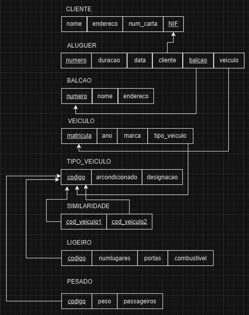
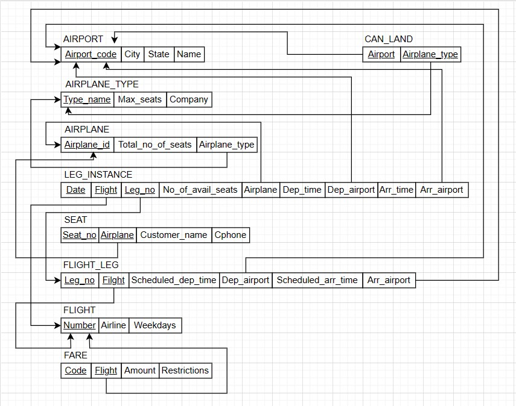
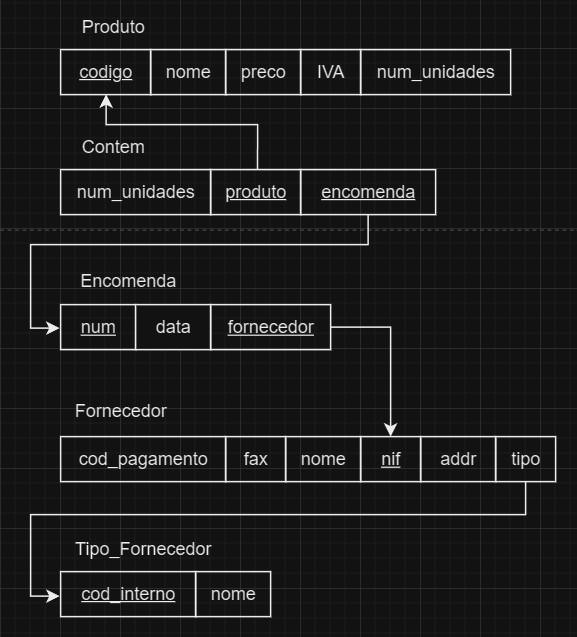
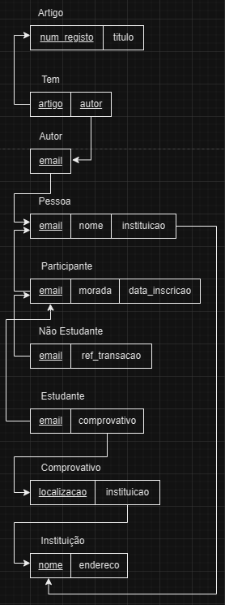
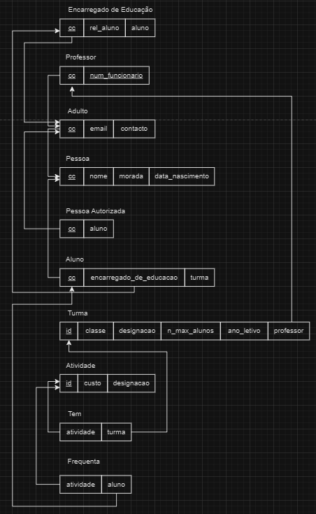

# BD: Guião 3


## ​Problema 3.1
 
### *a)*

```
Cliente (nome, endereço, num_carta, NIF)
Aluguer (número, duração, data)
Balcão (nome, número, endereço)
VEICULO(matricula, marca, ano)
TIPO_VEICULO(designacao, arcondicionado, codigo)
LIGEIRO(codigo, numlugares, portas, combustivel)
PESADO(codigo, peso, passageiros)    
SIMILARIDADE(cod_veiculo1, cod_veiculo2)
```


### *b)* 

```
Chaves candidatas:
Cliente - {num_carta}{NIF}
Aluguer - {número}
Balcão - {número}
VEICULO: {matricula}
TIPO_VEICULO: {codigo}
LIGEIRO: {codigo}
PESADO: {codigo}
SIMILARIDADE: {cod_veiculo1, cod_veiculo2}

Chaves primárias:
Cliente - {NIF}
Aluguer - {número}
Balcão - {número}
VEICULO: {matricula}
TIPO_VEICULO: {codigo}
LIGEIRO: {codigo}
PESADO: {codigo}
SIMILARIDADE: {cod_veiculo1, cod_veiculo2}

Chaves estrangeiras:
Aluguer - {cli_NIF}, {num_balcao}, {matrícula}
LIGEIRO: {codigo}
PESADO: {codigo}
SIMILARIDADE: {cod_veiculo1, cod_veiculo2}
```


### *c)* 




## ​Problema 3.2

### *a)*

```
AIRPORT (Airport_code, City, State, Name)
AIRPLANE_TYPE (Company, Type_name, Max_seats)
AIRPLANE (Airplane_id, Total_no_of_seats)
FLIGHT (Number, Airline, Weekdays)
FLIGHT_LEG (Leg_no)
FARE (Restrictions, Amount, Code)
LEG_INSTANCE (Date, No_of_avail_seats)
SEAT (Seat_no)
CAN_LAND ()
```


### *b)* 

```
Chaves candidatas:
AIRPORT: {Airport_code}
AIRPLANE_TYPE: {Type_name}
AIRPLANE: {Airplane_id}
FLIGHT: {Number}
FLIGHT_LEG: {Leg_no, Flight}
FARE: {Code, Flight}
LEG_INSTANCE: {Date, Flight, Leg_no}
SEAT: {Seat_no, Airplane}
CAN_LAND: {Airport, Airplane_type}

Chaves primárias:
AIRPORT: {Airport_code}
AIRPLANE_TYPE: {Type_name}
AIRPLANE: {Airplane_id}
FLIGHT: {Number}
FLIGHT_LEG: {Leg_no, Flight}
FARE: {Code, Flight}
LEG_INSTANCE: {Date, Flight, Leg_no}
SEAT: {Seat_no, Airplane}
CAN_LAND: {Airport, Airplane_type}

Chaves estrangeiras:
AIRPLANE: {Airplane_type}
FLIGHT_LEG: {Flight}, {Dep_airport}, {Arr_airport}, {Scheduled_dep_time}, {Scheduled_arr_time}
FARE: {Flight}
LEG_INSTANCE: {Airplane}, {Dep_airport}, {Arr_airport}, {Dep_time}, {Arr_time}, {Flight}, {Leg_no}
SEAT: {Customer_name}, {Cphone}, {Airplane}
CAN_LAND: {Airport}, {Airplane_type}
```


### *c)* 




## ​Problema 3.3


### *a)* 2.1



### *b)* 2.2


### *c)* 2.3



### *d)* 2.4

