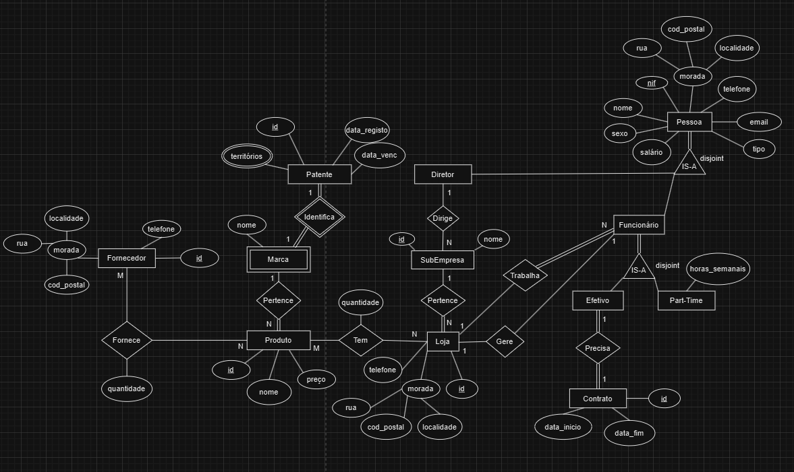
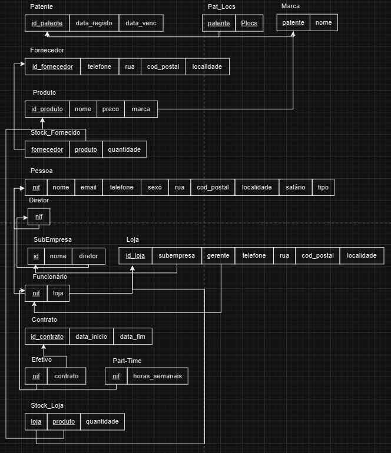
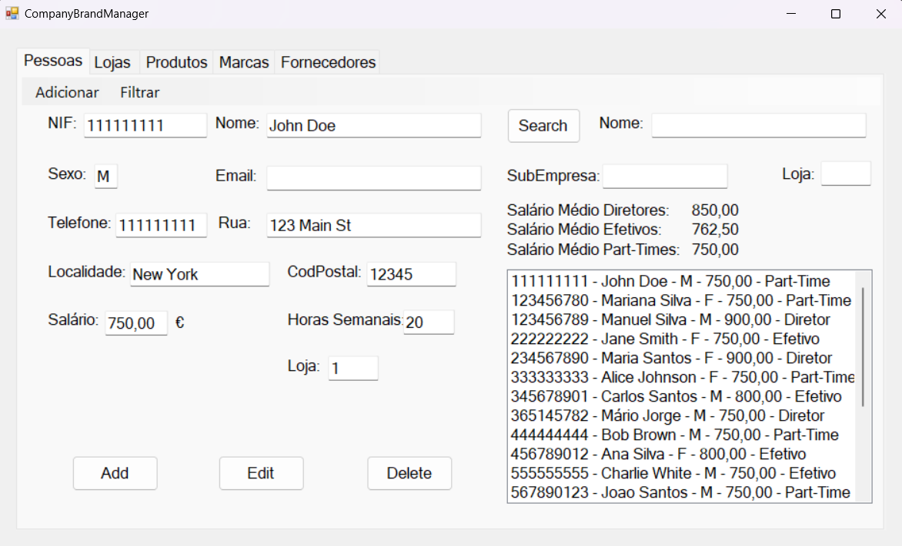
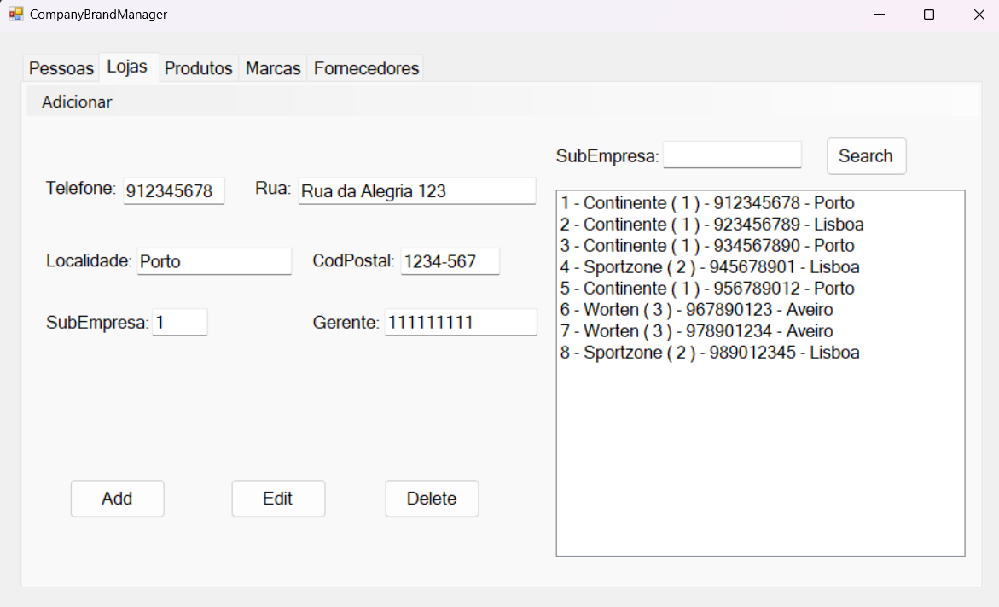
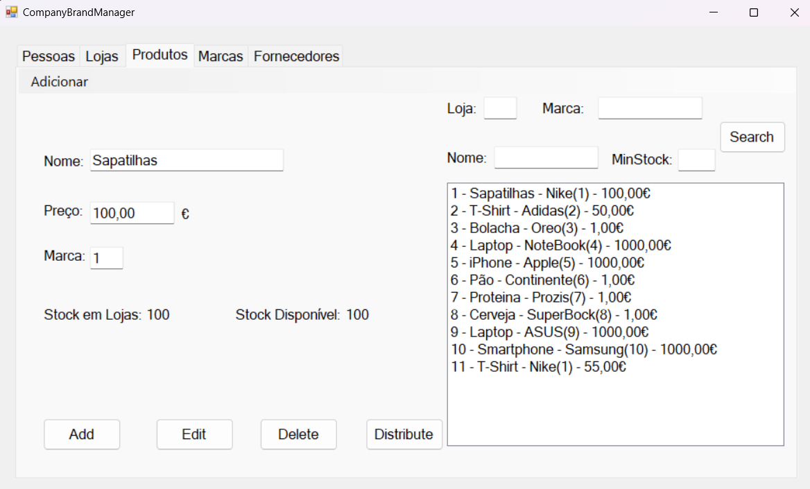
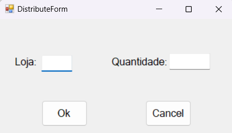
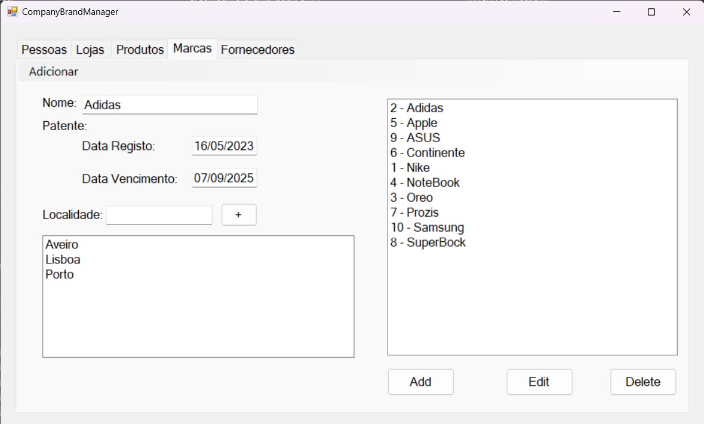
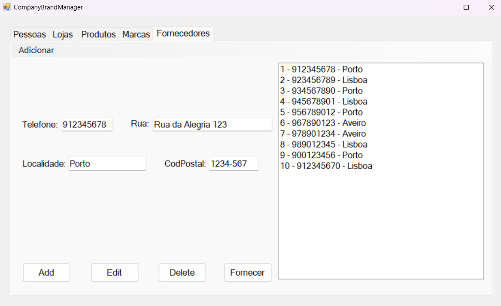
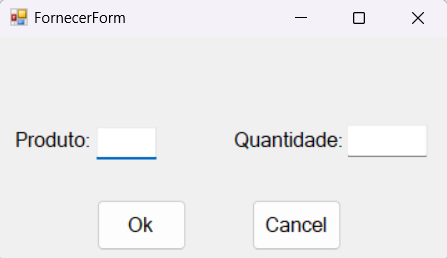

# BD: Trabalho Prático APF-T

**Grupo**: P5G10
- Guilherme Santos, MEC: 113893
- Diogo Guedes, MEC: 114256

## Introdução / Introduction
 
O projeto consiste num sistema que visa facilitar os administradores de uma grande empresa (ex: Sonae) que pode ser dona de várias subempresas (ex: Sportzone, Worten, etc) a gerir todos os seus funcionários, quem gere o quê, quem dirige o quê e, principalemnte, gerir os seus produtos pois, para uma empresa vender produtos precisa de ter certas autorizações e certas patentes das marcas desses produtos.

## ​Análise de Requisitos / Requirements

## DER - Diagrama Entidade Relacionamento/Entity Relationship Diagram

### Versão final/Final version



### APFE 

Retirou-se a entidade Gerente pois resultava numa duplicação de dados, numa inconsistência na base de dados e adicionava complexidade desnecessária na gestão da base de dados, assim, direcionou-se a relação "Gere" diretamente para a entidade Funcionário.
Retirou-se a obrigatoriedade de uma loja necessitar de um Funcionário gerente de forma a acabar com a dependência circular obrigatória que tornava impossível criar Funcionario e criar Loja.
Tirou-se a obrigatoriedade dos dois lados entre Diretor e SubEmpresa de forma a facilitar a sua gestão.
Atributo tipo retirado de Funcionário e adicionado a Pessoa para facilitar a identificação da Pessoa visto que se tirou o Cliente 

## ER - Esquema Relacional/Relational Schema

### Versão final/Final Version



### APFE

Retirou-se também a Entidade Gerente e corrigiram-se vários erros.
Adicionada a relação circular entre Funcionário e Loja (Funcionário tem uma Loja e Loja pode ter um gerente que é um Funcionário)

## ​SQL DDL - Data Definition Language

[SQL DDL File](sql/01_ddl.sql "SQLFileQuestion")

## SQL DML - Data Manipulation Language

### Formulário Pessoas



```sql
-- Mostrar Pessoas com ou sem filtro
EXEC SearchPessoa @nome_pessoa, @tipo, @nome_subempresa, @id_loja,

-- Inserir nova Pessoa
EXEC AddPartTimeEmployee @Nif, @Nome, @Sexo, @Email, @Telefone, @Rua,@CodigoPostal, @Localidade, @Salario, @Loja, @HorasSemanais

EXEC AddDirector @Nif, @Nome, @Sexo, @Email, @Telefone, @Rua, @CodigoPostal, @Localidade, @Salario

EXEC AddEffectiveEmployee @Nif, @Nome, @Sexo, @Email, @Telefone, @Rua, @CodigoPostal, @Localidade, @Salario, @Loja, @InicioContrato, @FimContrato

-- Editar Pessoa
UPDATE Pessoa SET nif = @nif, nome = @nome, email = @email, sexo = @sexo, telefone = @telefone, rua = @rua, codigo_postal = @codigo_postal, localidade = @localidade, salario = @salario WHERE nif = @nifAnterior

UPDATE Part_Time SET horas_semanais = @horas_semanais WHERE nif = @nif

UPDATE Contrato SET data_inicio = @data_inicio, data_fim = @data_fim WHERE id_contrato = (SELECT contrato FROM Efetivo WHERE nif = @nif)

UPDATE Funcionario SET loja = @loja WHERE nif = @nif

-- Remover Pessoa
DELETE FROM Pessoa WHERE nif = @Nif
```
### Formulário Lojas

```sql
-- Mostrar Loja por SubEmpresa ou não
SELECT * FROM Loja JOIN SubEmpresa ON Loja.subempresa = SubEmpresa.id WHERE SubEmpresa.nome LIKE @subempresaName --(query parameterizada com "%" + subempresa + "%" como argumento do parâmetro)

-- Adicionar Loja
INSERT INTO Loja(telefone, rua, codigo_postal, localidade, subempresa, gerente) VALUES (@Telefone, @Rua, @CodigoPostal, @Localidade, @Subempresa, @Gerente)

-- Editar Loja
UPDATE Loja SET telefone = @telefone, rua = @rua, codigo_postal = @codigo_postal, localidade = @localidade, subempresa = @subempresa, gerente = @gerente WHERE id_loja = @id_loja

-- Remover Loja
DELETE FROM Loja WHERE id_loja = @loja_id
```

### Formulário Produtos


```sql
-- Mostrar Produto com ou sem procura filtrada
EXEC SearchProduto @marcaNome, @nomeProduto, @quantidadeMin, @id_loja

-- Adicionar Produto
INSERT INTO Produto(preco, nome, marca) VALUES (@Preco, @Nome, @Marca)

-- Editar Produto
UPDATE Produto SET preco = @preco, nome = @nome, marca = @marca WHERE id_produto = @id_produto

-- Remover Produto
DELETE FROM Produto WHERE id_produto = @id_produto

-- Distribuir Produto
```

```sql
INSERT INTO Stock_Loja (loja, produto, quantidade) VALUES (@lojaId, @produtoId, @quantidade);
-- OU
UPDATE Stock_Loja SET quantidade = quantidade + @quantidade WHERE loja = @lojaId AND produto = @produtoId;
```

### Formulário Marcas

```sql
-- Adicionar Marca
EXEC AddMarca @Nome, @Data_registo, @Data_vencimento
INSERT INTO Pat_Locs(patente, Ploc) VALUES ((SELECT MAX(patente) FROM Marca), @localidade)

-- Editar Marca
UPDATE Patente SET data_registo = @data_registo, data_vencimento = @data_vencimento WHERE id_patente = @id
UPDATE Marca SET marcaNome = @nome WHERE patente = @id
INSERT INTO Pat_Locs(patente, Ploc) VALUES (@patente, @localidade) -- Adicionar Novas Localidades
DELETE FROM Pat_Locs WHERE patente = @patente AND Ploc = @localidade -- Remover Localidades

-- Remover Marca
DELETE FROM Patente WHERE id_patente = @patente
```
### Formulário Fornecedores

```sql
-- Adicionar Fornecedor
INSERT INTO Fornecedor(telefone, rua, codigo_postal, localidade) VALUES (@Telefone, @Rua, @CodigoPostal, @Localidade)

-- Editar Fornecedor
UPDATE Fornecedor SET telefone = @telefone, rua = @rua, codigo_postal = @codigo_postal, localidade = @localidade WHERE id_fornecedor = @id_fornecedor

-- Remover Fornecedor
DELETE FROM Fornecedor WHERE id_fornecedor = @id_fornecedor

-- Fornecer Produto
```

```sql
INSERT INTO Stock_Fornecido VALUES (@fornecedorId, @produtoId, @quantidade)
-- OU
UPDATE Stock_Fornecido SET quantidade = quantidade + @quantidade WHERE produto = @produtoId AND fornecedor = @fornecedorId
```
## Normalização/Normalization

De forma a minimalizar a duplicação de dados e de forma a normalizar a base de dados, no desenvolvimento do diagrama ER, seguimos todas as regras de normalização a partir do diagrama DER, ou seja, sempre que tinhamos uma relação 1-N, em ER adicionávamos uma chave estrangeira na entidade que só pode ter 1 elemento, como por exemplo, a Loja pode ter vários funcionários mas um funcionário só pode ter uma loja logo adicionamos a chave estrangeira loja á entidade Funcionário. Sempre que tínhamos entidades N-M criámos uma entidade nova fruto dessa relação em que a chave primária é um tuplo de chaves estrangeiras com as chaves primárias das duas entidades dessa relação. Em atributos multi-valor como os territórios, criámos uma entidade nova para guardar as localidades. Em zonas com o IS-A, nas entidades resultado dessa disjunção, apenas temos como chave primária uma chave estrangeira da Entidade superior de forma a não repetir dados. E, sempre que tínhamos entidades com atributos muito parecidos dividiamos usando uma relação IS-A.

## Índices/Indexes

```sql
-- Índices para ajudar da procura de um produto pelo seu nome ou pelo nome da sua marca
CREATE INDEX idx_Marca_marcaNome ON Marca(marcaNome);
CREATE INDEX idx_Produto_nome ON Produto(nome);

-- Índices para ajudar na procura de uma pessoa pelo seu nome, tipo (em caso de filtragem) ou nome da subempresa
CREATE INDEX idx_Pessoa_tipoNome ON Pessoa(tipo, nome);
CREATE INDEX idx_SubEmpresa_nome ON SubEmpresa(nome);

-- Foram criados estes índices pois, devido a não serem pesquisas por primary keys, sem esta criação de non-clustered indexes, caso haja um número muito grande de inserções nas tabelas, a pesquisa iria demorar muito tempo
```

## SQL Programming: Stored Procedures, Triggers, UDF

[SQL SPs and Functions File](sql/02_sp_functions.sql "SQLFileQuestion")

[SQL Triggers File](sql/03_triggers.sql "SQLFileQuestion")

### Dados iniciais da dabase de dados/Database init data

[Indexes File](sql/01_ddl.sql "SQLFileQuestion")

### Apresentação

[Slides](slides.pdf "Sildes")

[Video](https://uapt33090-my.sharepoint.com/personal/gui_santos91_ua_pt/_layouts/15/stream.aspx?id=%2Fpersonal%2Fgui%5Fsantos91%5Fua%5Fpt%2FDocuments%2FSGBD%5FBD%5F23%5F24%2Emp4&nav=eyJyZWZlcnJhbEluZm8iOnsicmVmZXJyYWxBcHAiOiJTdHJlYW1XZWJBcHAiLCJyZWZlcnJhbFZpZXciOiJTaGFyZURpYWxvZy1MaW5rIiwicmVmZXJyYWxBcHBQbGF0Zm9ybSI6IldlYiIsInJlZmVycmFsTW9kZSI6InZpZXcifX0&ga=1&referrer=StreamWebApp%2EWeb&referrerScenario=AddressBarCopied%2Eview%2Eac42afc0%2D7127%2D44e2%2D991d%2Ddd791ab1c287)


 